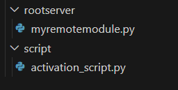
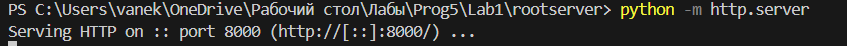
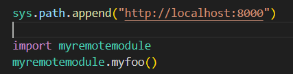
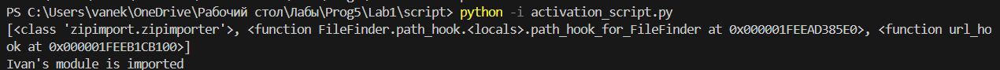
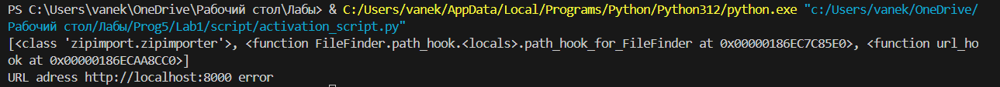

# Лабораторная работа 1
## Реализация удаленного импорта
### 1. удаленный импорт модуля
Директории с модулем и скриптом:\


myremotemodule.py :
```
def myfoo():
    author = "Ivan"
    print(f"{author}'s module is imported")
```

activation_script.py :
```
import re
import sys
from urllib.request import urlopen


def url_hook(some_str):
      
    if not some_str.startswith(("http", "https")):
        raise ImportError
    with urlopen(some_str) as page: # requests.get()
        data = page.read().decode("utf-8")
    filenames = re.findall("[a-zA-Z_][a-zA-Z0-9_]*.py", data)
    modnames = {name[:-3] for name in filenames}
    return URLFinder(some_str, modnames)


sys.path_hooks.append(url_hook)
print(sys.path_hooks)

# А теперь опишем функцию, в которой мы 
# для "перехваченного" адреса URL модуля будем делать импорт

from urllib.request import urlopen

class URLLoader:
    def create_module(self, target):
        return None
    
    def exec_module(self, module):
        with urlopen(module.__spec__.origin) as page:
            source = page.read()
        code = compile(source, module.__spec__.origin, mode="exec")
        exec(code, module.__dict__)

# В URLFinder и будет срабатывать функция url_hook, которая и будет перехватывать ситуацию, в которой загрузка модуля 
# должна идти по URL-адресу

from importlib.abc import PathEntryFinder
from importlib.util import spec_from_loader

class URLFinder(PathEntryFinder):
    def __init__(self, url, available):
        self.url = url
        self.available = available
        
    def find_spec(self, name, target=None):
        if name in self.available:
            origin = "{}/{}.py".format(self.url, name)
            loader = URLLoader()
            return spec_from_loader(name, loader, origin=origin)
        
        else:
            return None
```

Запуск локального сервера с модулем:\


Подключение к серверу и импорт (и исполнение функции) модуля:\


Исполнение скрипта:\


### 1.1 Переписать содержимое функции url_hook, класса URLLoader с помощью модуля requests (см. комменты).

Добавляем импорт модуля:
```
from requests import get
```

Меняем функцию под модуль request:
```
  with get(some_str) as page:
        data = page.text
```
### 1.2 Задание со звездочкой (*): реализовать обработку исключения в ситуации, когда хост (где лежит модуль) недоступен.

Обработка исключения была исполнена с помощью "try и except", с функцией "sys.exit"
```
def url_hook(some_str):
      
    if not some_str.startswith(("http", "https")):
        raise ImportError
    try:
        with get(some_str) as page:
            data = page.text
        filenames = re.findall("[a-zA-Z_][a-zA-Z0-9_]*.py", data)
        modnames = {name[:-3] for name in filenames}
        return URLFinder(some_str, modnames)
    except:
        sys.exit(f"URL adress {some_str} error")
```
Вывод: 

### 2. удаленный импорт пакета

Для удаленного импорта пакета создаем пакет
Для этого создаем файл \_\_init__.py в папке rootserver:
```
from myremotemodule import myfoo

myfoo()
```

    