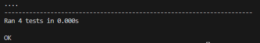
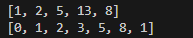

# Лабораторная работа 4. Ряд Фибоначчи с помощью итераторов
## Задание 1. Создание сопрограммы на основе кода, позволяющей по данному n сгенерировать список элементов из ряда Фибоначчи.

# 1.1 Реализация сопрограммы

Сопрограммы выполнена функцией my_genn:

```
def my_genn():
    """Сопрограмма"""

    itt = fib_elem_gen()
    while True:
        number_of_fib_elem = yield
        l = [next(itt) for _ in range(number_of_fib_elem)]
        yield l
```


# 1.2 Тесты программы

Тесты я реализовал с помощью пакета unittest:\
```
import unittest
from gen_fib import fib


class TestFib(unittest.TestCase):
    def setUp(self):
        self.fib = fib

    def test_fib_1(self):
        self.assertEqual(self.fib(3), [0, 1, 1])
    
    def test_fib_2(self):
        self.assertEqual(self.fib(5), [0, 1, 1, 2, 3])

    def test_fib_3(self):
        self.assertEqual(self.fib(0), [])

    def test_fib_4(self):
        self.assertEqual(self.fib(-1), [])

unittest.main()
```

Соответственно при исполнении выводит красивый вывод:\


## Задание 2 Дополните код классом FibonacchiLst, который бы позволял перебирать элементы из ряда Фибоначчи по данному ей списку. Итератор должен вернуть очередное значение, которое принадлежит ряду Фибоначчи, из данного ей списка. 

Для данной задачи разработан класс FibonacchiLst, подробнее функция \_\_next__() класса :
```
    def __next__(self):
        """
        Функция прокручивает исходный список, по каждому элементу генерируя список фибоначи и проверяя наличие элемента в этом списке.
        """
        while True:
            try:
                res = self.instance[self.idx] 
                fiblst = self.go_fib(res)

            except IndexError:
                raise StopIteration
            
            if res in fiblst:
                self.idx += 1
                return res
            self.idx += 1
```

Программа получает на вход:
```
print(list(FibonacchiLst([1, 4, 24, 2, 5, 13, 22, 28, 31, 8, 17, 74])))
print(list(FibonacchiLst([0, 1, 2, 3, 4, 5, 6, 7, 8, 9, 1])))
```
И выдает:\
