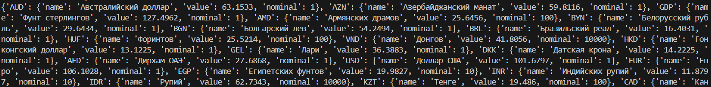
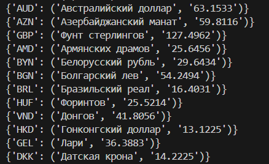
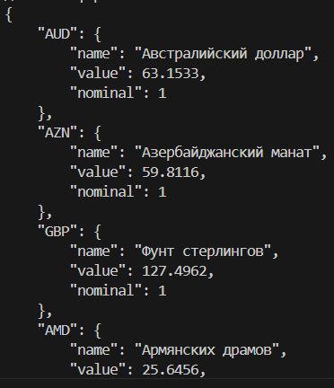
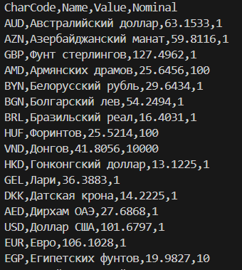

# Лабораторная работ №6 "Декортатор"
### Задача:
Примените паттерн декоратор и реализуйте объектно-ориентированную версию программы получения курсов валют с сайта Центробанка
### Выполнено:
Применены декораторы для реализации:
1. получения базовой версии для получения информации о валютах в формате словаря:\n

2. получеия базовой версии для получения информации о валютах в формате словаря с структурой описаной в лр5:\n

3. получения в формате JSON:\n

4. получения в формате CSV:\n

